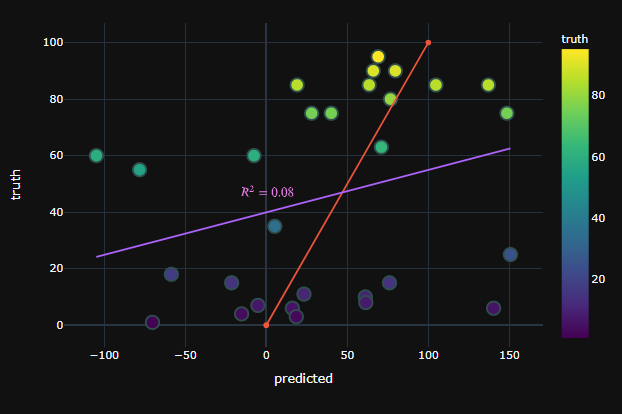
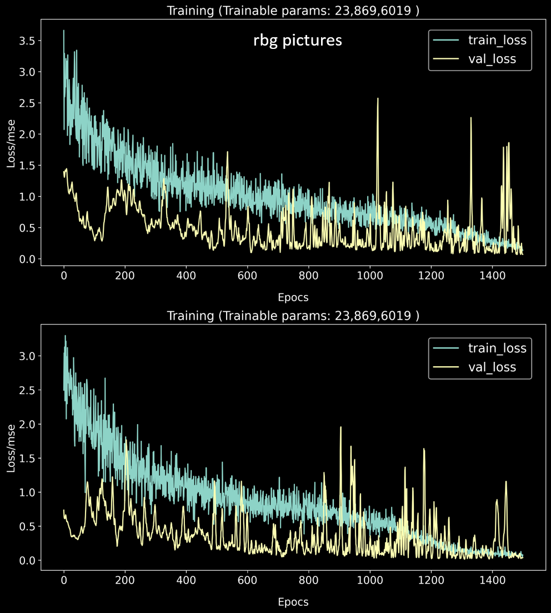
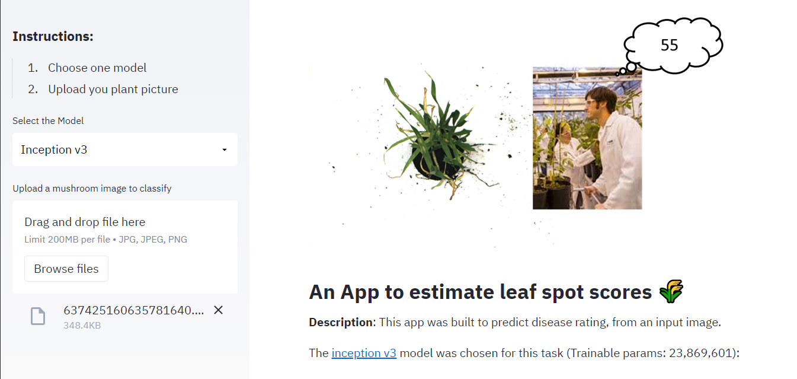

# Leaf_disease_estimator

**[See full code here](https://nbviewer.jupyter.org/github/EnriqueSPR/leaf_disease/blob/master/leaf_disease_estimator.ipynb)**.

## **An App to estimate leaf spot disease scores on cereals 🌾**

* **Description**: The goal of this project was to use CNNs to predict the disease rating, from an input image. 

* **Introduction**: Plant diseases have long been one of the major threats to food security because they dramatically reduce the crop yield and compromises its quality. Accurate and precise estimation of the disease level has been a difficult challenge. Nonetheless, over the last years, the depelopment of deep learning approaches and in particular of CNNs, has brought significant progress to the automatic estimation of crop disease levels. These advances in image processing will definetely benefit the **decission making** process for farmers and they will pave the way towards more sustainable agro-systems 🔄. Furthermore, such automatized phenotypic tools will play an important role in the **crop improvement programs** where plant phenotyping has largely been the most labour-intensive part of the process.

* **Challenges**. There are two **main issues** that remain with the use of CNNs:

  * Require **large datasets**. 
  * Database construction can be **labour intensive** (all pictures need to be properly labeled with the correct disease).
    
    > Hence, there is an increasing interest in developing well-performing models by using **small picture datasets**.

    > In this project I will use a very small picture dataset (144 pictures total) and try to overcome the issues associated.

### Code and Resources Used

* **Python Version**: 3.7

* **Packages**: pandas (1.1.3), numpy (1.19.5), sklearn (0.24.1), os, glob, scipy (1.6.0), matplotlib (3.3.4), plotly (4.14.3), streamlit (0.79.0), PIL, cv2 (4.4.0), pickle, keras (2.4.0).

## Schema of the approach:

**1. Review the literature** 📚:

**2. Inspect the target variable and the picture dataset** 🖼📊:
    
**3. Choose an approach for our given problem 🎯**:

*It is a good idea to start from a simple approach and improve it from there.*

**4. Resize pictures, split the dataset and use data augmentation**:

**5. Adapting the Inception_V3 Architecture for our regression problem**:

**6. Propose possible improvements**:   

**7. Leaf segmentation**:

**8. Model Deployment**:
   
---

## 1. Review of the literature

Before jumping into coding, it is important to find out what other image-based methods have been used for similar tasks as the one presented here.
This is key to choose a good approach for our particular problem.

* Leaf spot diseases result in different leaf symptoms which include [necrotic and spot-like leaf lessions](https://www.ag.ndsu.edu/publications/crops/fungal-leaf-spot-diseases-of-wheat-tan-spot-septoria-stagonospora-nodorum-blotch-and-septoria-tritici-blotch).

* The problem plant disease recognition has been historically based on conventional machine learning techniques such as Support Vector Machines, Multilayer Perceptron Neural Networks and Decision Trees. However, the prevailing approach has shifted to the application of deep learning concepts, with focus on **Convolutional Neural Networks (CNNs)** [[Reference 2018](https://www.sciencedirect.com/science/article/abs/pii/S0168169918304617)], [[Reference 2019](https://www.ncbi.nlm.nih.gov/pmc/articles/PMC6413718/)], [Reference 2020](https://link.springer.com/article/10.1007/s41870-020-00437-5)].

* CNNs have been used multiple times for **regression** [[Reference 2020](https://plantmethods.biomedcentral.com/articles/10.1186/s13007-020-00698-y)], but some considerations need to be made for a regression use case.

    * We need to ensure that your final fully connected layer uses a linear activation function instead of sigmoid.
    * There have been studies that showed a better model performance using a classification-then-regression trick: A first network only determines if y should be in one of, say, 10 bins. A second network then performs the regression task [[Reference 2015](https://lmb.informatik.uni-freiburg.de/Publications/2015/FDB15/image_orientation.pdf)].
    

* There have been a number of **interesting approaches** to tackle the issue with dealing with small picture datasets which include:

   * CNN (InceptionV3 and AlexNet) for feature extraction followed by SVM for classification [[Reference (2019)](https://www.researchgate.net/publication/334743331_RICE_PLANT_DISEASE_CLASSIFICATION_USING_TRANSFER_LEARNING_OF_DEEP_CONVOLUTION_NEURAL_NETWORK)], [[Reference (2020)](https://www.sciencedirect.com/science/article/abs/pii/S0168169920302544)].
   * Siamese Networks (InceptionV3) [[Ref 2020](https://www.sciencedirect.com/science/article/abs/pii/S0168169920302544)]
   
---

## 2. Inspect the target variable (severity of infection) and the picture dataset.

* As we can observe in the plot below, we will be dealing with a **challenging dataset**, not only due to its small size, but also the apparent class imbalance.

  
 
* Inspecting the picture dataset we can see that these are rectangular pictures with a **ratio of 1.33 and a size of 1390 x 1038 pixels**.

 
 
---

## 3. Choose an approach for our given problem 🎯:

* An important aspect to consider is the **image size and aspect ratio**:

It is important to note that tradititonal **CNNs are not scale-invariant**, hence, we should re-scale the images to an **square format**. There are three main approaches for this:

*Note: Another option would be to make our own network architecture taking image features into account by using asymmetric pooling and convolutions*

> 1. **Padding the image with 0s**: This approach is not the most recommended, specially having large picture size such in our particular case. [Read here](https://datascience.stackexchange.com/questions/30819/image-resizing-and-padding-for-cnn) and [here](https://stackoverflow.com/questions/47697622/cnn-image-resizing-vs-padding-keeping-aspect-ratio-or-not/49882055#49882055).

> 2. **Resize the pictures with out preserving the aspect ratio** (no cropping involved).

>  3. **Crop down the picture to preserve the aspect ratio of the picture**. This allows us to maintain a consistent aspect ratio, which helps the CNN to learn more discriminative, consistent features, but potentially loosing information after the cropping process. 

The third approach could be detrimental because there may be a direct association between larger leaves and disease severity. Hence, for our use case, the second approach should be preferred.

* My approaches will rely on **four main strategies** thave been shown to be very effective when faced with **small picture datasets**:

> 1. **Data Augmentation**: used to generate new training samples from the original ones by applying random modifications and perturbations such that the classes labels are not changed. 

> 2. **Transfer Learning by placing a new set of FC layers on top of the CNN**, and then fine-tuning these weights.

> 3. **Cross-Validation**

> 4. **Transfer Learning by treating networks as arbitrary feature extractors**.

* Finally, is also worth noticing that our dataset is somewhat similar to a famous benchmark dataset extensively used in a **Leaf Segmentation Challenge (LSC)** from the Computer Vision Problems in Plant Phenotyping platform (**[CVPPP](https://www.plant-phenotyping.org/CVPPP2020)**). Similarly, all images are taken from the top and have uniform backgrounds.
Hence, a transfer learning approach could be also used taking advantage of one of the state of the art models trained on the CVPPP dataset (i.e. **[Mask R-CNN](https://github.com/csiro-robotics/UPGen)**). For this, we should have segmented versions of our pictures. A possibility that I mention in the last section (possible improvements).
---

## 4. Resize pictures and use data augmentation.

* Data Split: Stratified data split was performed to preserve equal distribution of disease severity accross sets.
*Note: ``MinMaxScaler`` was used after splitting to scale the target variable between 0 and 1*.

 

* Data Augmentation: Rotation, vertical and horizontal flippling were used in this case to enhance the train set.

 

---

## 5. Approach: Adapting the Inception_V3 Architecture for our regression problem.

* **Tranfer learning**: We will exclude the last two layers of the inception_v3 model and include our ``GlobalAveragePooling2D``, ``Dense``, ``BatchNormalization``, ``Dropout`` and most importantly a last dense layer with a ``linear`` activation fuction to perform the regression.

   > 1. Train the network with a learning rate of 0.001 with all inception_v3 layers trained in the imagenet dataset frozen.
   > 2. Unfreeze all layers and fine-tune the model with a learning rate = 0.00001.

* **Model Evaluation**:

Mean absolute error(mae) and mean squared error(mse) were used as evaluation metrics. As loss function mse was used to penalize more the large errors.

      Final model -> mae:  0.06, mse:  0.22, loss:  0.06
      
In the plot below the predicted values for the test set are ploted against the truth values. The red line represents the perfect prediction, whereas the purple line is the trend line (r2=0.58) 

---

## 6. Possible Improvements

* **A)** One of the possible set of improvements that can bring a better performance over the first approach is to use one or several of the following techniques to deal **data imbalance**:

    * **Oversampling**: Increasing the number of pictures for the under-represented disease levels. Data augmentation techniques can also be of use here. [[Reference](https://towardsdatascience.com/deep-learning-unbalanced-training-data-solve-it-like-this-6c528e9efea6)].
    
    * **Synthetic Minority Over-sampling Technique(SMOTE)**. This would require to increase the number of samples for the minority classes. [See github issue](https://github.com/scikit-learn-contrib/imbalanced-learn/issues/27)
    
    * **Adjust the weights** to the classess.
    
    * **Define our custom loss-function**.

* **B) Increase the picture dataset**: 

    * As suggested above, improving the number of labeled pictures (in particular for the minority disease score), would help us to improve the model's performance furher.
    
    * Furthermore, it would be interesting to complement the pictures taken from above with **side pictures** of the plants.

    
* **C)** Try other **image-preprocessing methods**:

     * **Background-removal**
     
     * **Semantic segmentation**

    * **Instance Segmentation**: 
    
        * 1. Mask R-CNN: To automatically segment and construct pixel-wise masks for our pictures. For this we could use the [matterport repository](https://github.com/matterport/Mask_RCNN).
        * 2. Perform transfer learning using a [state-of-the-art](https://github.com/csiro-robotics/UPGen) model used for leaf phenotyping.

* **D)** Perform **cross-validation** for hyper-parameter tunning.
   

* **E)** **Try other algorithms**

    * **Other CNN architectures**: i.e Xception, EfficientNetB7, Resnet...
    * **Transformers**: They represent a breakthrough in deep neural network architectures that has recently unlocked dramatic advances across many areas of AI, including [computer vision](https://arxiv.org/abs/2010.11929).
---

## 7. Leaf segmentation

In an attempt to improve the model performance I segmented the pictures using this [repository on github](https://github.com/YaredTaddese/leaf-image-segmentation).

*Note: In this case the pictures have a white background (only some debry is present in the background), so the effects of the segmentation may not have a large effect on the model performance*

See below an example of segmented images:

When we compare the training using segmented and the original rgb pictures we see a quicker drop on the ``val_loss`` (mse), which may be the result of a more focused training on the leaf-related features, which we expect to be associated to disease severity.

---

## 8. Oversampling of the minority classes with data augmentation

In this section I will use data augmentation to oversample the minority classes. For this I will create a train, val and test folders, and apply data augmentation on the train and val sets.

* Label target variable distribution before data augmentation (train + val + test sets):

* Label target variable distribution after data augmentation (train + val sets):

* Target distribution on the three sets:

 

* Model training:

We can see how by performing data augmentation the loss decreased faster.

* Model evaluation:

Mean absolute error(mae) and mean squared error(mse) were used as evaluation metrics. As loss function mse was used to penalize more the large errors.

      Final model -> mae:  0.14, mse:  0.33, loss:  0.14
      
In the plot below the predicted values for the test set are ploted against the truth values. The red line represents the perfect prediction, whereas the purple line is the trend line (r2=0.08) 

We can see that we did not improve model's performance on the test set by oversampling the train and val sets using data augmentation on the minority classes.
Indeed, we can expect the model to generalize better accross disease levels, but since the test set is unevenly distributed, performance is hurt.

---

## 9. Model Deployment

An app was built locally with the [Streamlit](https://streamlit.io/) package and deployed it using the [Heroku](https://dashboard.heroku.com/apps) framework.

See below couple of screenshots of the app:

---
